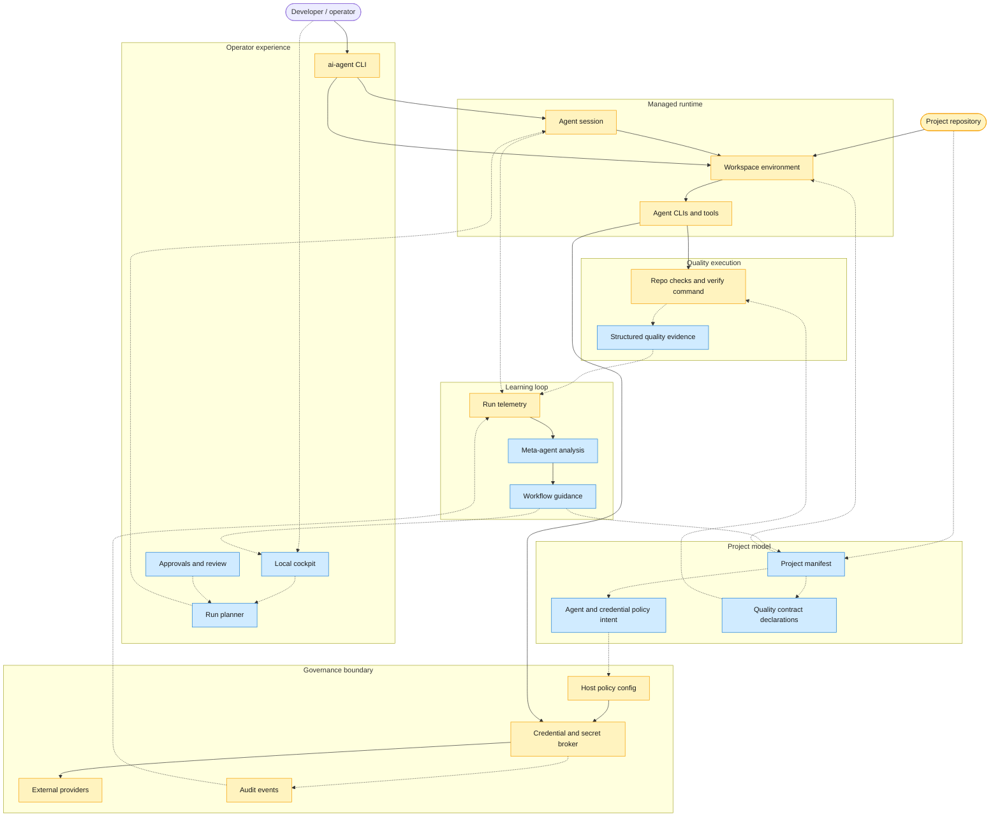
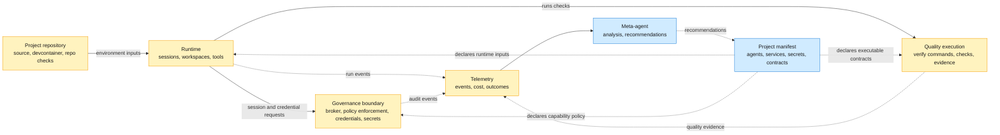

# Current and North-Star Architecture

AI Crew localdev is a local control plane for AI coding agents. Its architecture is organized around governed agent work: projects declare expectations, agents run in managed local environments, credentials are mediated by a host-side broker, quality is enforced by executable contracts, and telemetry feeds future workflow improvement.

This document states the core architecture characteristics and key decisions. Implementation mechanics, command behavior, tests, and operational details belong in code, ADRs, user docs, or runbooks.

## Architecture Layers

Yellow nodes exist today; blue nodes are north-star. Solid edges are implemented control paths; dashed edges are planned declaration, observation, or adaptive feedback paths.

The current control path is CLI driven: `ai-agent up` enters a managed workspace, `ai-agent run` creates broker sessions, emits durable run telemetry, and agents request brokered credentials while optionally running repo-local checks. Operators inspect canonical local summaries with `ai-agent runs` and can export the same lifecycle through OTLP. The north-star layers add a cockpit, planner, project manifest, structured contract declarations, dashboards, and adaptive telemetry analysis; those pieces should consume the existing runtime and governance boundary rather than move policy enforcement into project code.

## Domain Relationships

The governed substrate (yellow) exists today. Managed-run telemetry now has a first implemented slice; project manifests and meta-agent analysis (blue) are north-star. Solid edges are implemented execution dependencies. Dashed edges are planned declaration, observation, or recommendation dependencies.

This view intentionally separates declaration from enforcement. Project repositories supply runtime inputs today, but they do not enforce governance or own structured quality contracts yet. Runtime asks the governance boundary for credentials and invokes quality checks; north-star project manifests will declare the policy intents and executable contracts consumed by those domains.

The current implementation does not show a boundary flop between Project, Runtime, Governance, and Quality. The broker remains the governance boundary; project mode preserves a repository-owned devcontainer while injecting a read-only broker/toolchain overlay; and quality is invoked by runtime through repo-local checks or `--verify-cmd`. The architectural gap is that governance declarations and quality contracts are not yet first-class project-manifest concepts, so the previous relationship diagram overstated current coupling.

## Core Architecture Characteristics

| Characteristic | Architecture meaning | North-star direction |
|---|---|---|
| Governed | Agent work is mediated by explicit project, identity, credential, and approval policy. | Project manifests govern complete workflows, not only repository credentials. |
| Secure by default | Sensitive credentials and secrets stay behind a local governance boundary. | Agents receive mediated access to capabilities instead of direct access to durable secrets. |
| Project-aware | Runtime behavior is derived from the project being worked on. | Projects declare agents, services, caches, ports, secrets, contracts, and approval points. |
| Simple to enter | A developer should be able to enter a usable managed workspace without rebuilding the system mentally. | Installation, project startup, agent login, and re-entry become repeatable product flows. |
| Contract-driven | Quality is represented as executable evidence, not manual convention. | Every project has structured quality contracts with clear outcomes and retry guidance. |
| Observable | Runs produce durable events that explain what happened and why. | Auth, agent actions, checks, cost, tokens, resources, and outcomes share a stable run identity. |
| Adaptive | The system learns from repeated work rather than treating each run as isolated. | A meta-agent identifies waste, recurring failures, weak contracts, and better workflow defaults. |

## Enforceable Engineering Rules

These rules are acceptance criteria for new and refactored code. Existing violations are migration work, not precedent.

- Source code is self-documenting. Explanatory comments are replaced by precise names, types, cohesive functions, and explicit boundaries. Only directives that are executable inputs to the compiler or repository tooling remain.
- Security, threat-model, compatibility, and lifecycle claims are enforced in code and proven by focused automated checks. Documents declare intent and scope but never serve as enforcement.
- Operational tradeoffs have explicit budgets, observable measurements, and deterministic behavior when a budget is exceeded. Governance failures are visible and fail closed.
- Governance configuration is validated before publication and persisted with atomic, owner-only writes. Audit evidence is durable; saturation or storage failure becomes an explicit health or request failure rather than data loss.
- CLI packages own parsing and presentation. Application use cases own workflow orchestration. Broker core owns authorization and session decisions behind a stable transport contract. Provider adapters own provider-specific clients, signing, configuration, and payloads. Telemetry sinks own transport encoding, while telemetry policy owns the single export allowlist.
- Refactoring preserves user-facing commands, actionable errors, fail-closed credential behavior, and measurable latency and reliability benchmarks.

## Implemented Package Boundaries

- `internal/brokerapi` owns the stable socket transport contract and has no implementation dependencies.
- `internal/brokerport` owns the provider capability required by broker core and depends only on the transport contract and standard library.
- `internal/broker` owns authorization, session lifecycle, rate limiting, caching, and audit decisions without provider implementations.
- `internal/providers` owns provider HTTP clients, signing, configuration, resource grammar, and credential payload contracts.
- `internal/brokerclient` depends on the transport contract rather than broker core.
- `internal/sessionauth` owns managed-session environment and bind-FD authentication shared by command wrappers.
- `internal/onboarding` and `internal/readiness` own reusable application workflows with explicit inputs and constructed external ports; `internal/uphost` and `internal/devcontainer` own host process and container integration; the `up` command composes those concrete collaborators directly because no second workflow adapter exists.
- `internal/telemetry` separates lifecycle state, local persistence, managed OTLP projection, native ingestion, and transport delivery behind one policy registry; bounded queues and export failures produce deterministic warnings, and sink performance is tracked by benchmarks rather than runtime instrumentation with no operator consumer.
- `scripts/check-dependencies.sh` rejects forbidden imports in local verification and CI.
- `internal/quality/sourcecomments` rejects explanatory source comments and lint suppressions across tracked sources; local hooks and CI permit only executable directives.

## Key Decisions

- The broker is the credential and secret governance boundary. Project workflow intelligence belongs above it, not inside it.
- The broker API is credential-generic. GitHub is the first provider, but new credential types should be added as providers behind the same governance model.
- Signing and credential minting are host-side responsibilities. Containers and agents receive mediated access, not signing material.
- The trust model is single-user local workstation first. The architecture reduces blast radius for managed local agent work but does not claim protection from a fully compromised host user account.
- Managed sessions are fail-closed. If the governance boundary is unavailable, agent tooling should fail rather than silently use ambient personal credentials.
- Personal agent CLI state is intentionally separate from governed repo credentials. The generic devcontainer persists agent login and config under `/home/dev` in the `ai-agent-home` volume; GitHub repo access remains brokered through `ai-agent run`, git credential helpers, and the `gh` wrapper. Codex login reuse is tested with the real CLI; Claude OAuth reuse still needs provider-backed validation.
- Phase 1 sessions are single-repository. Multi-repository work needs an explicit allowlist model before it becomes a first-class workflow.
- GitHub operations in managed sessions are HTTPS-first. SSH support requires a separate broker-enforced credential model before it can join the governed path.
- The managed runtime is an execution environment, not the primary security boundary. Stronger containment, egress policy, and isolated state are future runtime decisions.
- Project devcontainers are preserved as project-owned environments. AI Crew should overlay governance and toolchain access without replacing a repository's own development environment.
- Project manifests are the north-star source of workflow truth. They should describe allowed agents, credentials, services, secrets, caches, ports, approval points, and executable contracts.
- Quality gates are product contracts. They should produce structured evidence that a run can use for retry, review, merge, or escalation decisions.
- Observability is built from durable run events. Screenshots, ad hoc logs, and manual notes are supporting evidence, not the source of truth.
- The meta-agent should start as an advisory layer. Expanding it to open PRs or modify manifests requires explicit policy and approval decisions.
- Distribution should move toward portable artifacts or images. Requiring a source checkout and local build is not the north-star user experience.
- The design rule is to keep the broker small, strict, and auditable while placing planning, adaptation, and project workflow behavior in higher layers.
