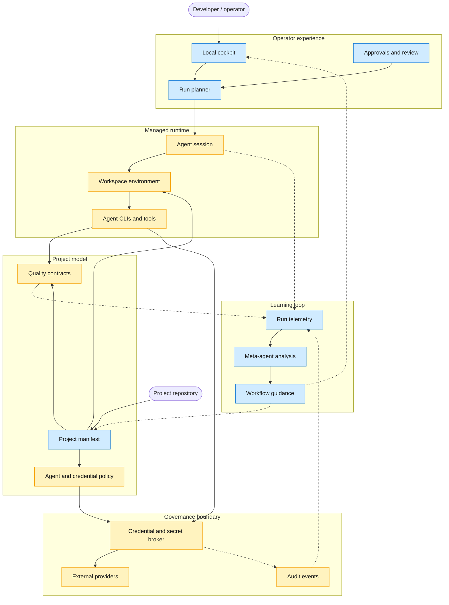
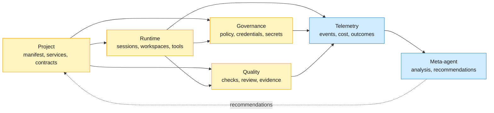

# Current and North-Star Architecture

AI Crew localdev is a local control plane for AI coding agents. Its architecture
is organized around governed agent work: projects declare expectations, agents
run in managed local environments, credentials are mediated by a host-side
broker, quality is enforced by executable contracts, and telemetry feeds future
workflow improvement.

This document states the core architecture characteristics and key decisions.
Implementation mechanics, command behavior, tests, and operational details
belong in code, ADRs, user docs, or runbooks.

## Architecture Layers

Yellow nodes exist today; blue nodes are north-star. Solid edges are the forward
control path; dashed edges are the observe-and-adapt plane: event emission into
telemetry and guidance fed back into the system.

## Domain Relationships

The governed substrate (yellow) exists today; the learning loop of telemetry and
meta-agent analysis (blue) is north-star.

## Core Architecture Characteristics

| Characteristic | Architecture meaning | North-star direction |
|---|---|---|
| Governed | Agent work is mediated by explicit project, identity, credential, and approval policy. | Project manifests govern complete workflows, not only repository credentials. |
| Secure by default | Sensitive credentials and secrets stay behind a local governance boundary. | Agents receive mediated access to capabilities instead of direct access to durable secrets. |
| Project-aware | Runtime behavior is derived from the project being worked on. | Projects declare agents, services, caches, ports, secrets, contracts, and approval points. |
| Simple to enter | A developer should be able to enter a usable managed workspace without rebuilding the system mentally. | Installation, project startup, agent login, and re-entry become repeatable product flows. |
| Contract-driven | Quality is represented as executable evidence, not manual convention. | Every project has structured quality contracts with clear outcomes and retry guidance. |
| Observable | Runs produce durable events that explain what happened and why. | Auth, agent actions, checks, cost, tokens, resources, and outcomes share a stable run identity. |
| Adaptive | The system learns from repeated work rather than treating each run as isolated. | A meta-agent identifies waste, recurring failures, weak contracts, and better workflow defaults. |

## Key Decisions

- The broker is the credential and secret governance boundary. Project workflow
  intelligence belongs above it, not inside it.
- The broker API is credential-generic. GitHub is the first provider, but new
  credential types should be added as providers behind the same governance
  model.
- Signing and credential minting are host-side responsibilities. Containers and
  agents receive mediated access, not signing material.
- The trust model is single-user local workstation first. The architecture
  reduces blast radius for managed local agent work but does not claim
  protection from a fully compromised host user account.
- Managed sessions are fail-closed. If the governance boundary is unavailable,
  agent tooling should fail rather than silently use ambient personal
  credentials.
- Phase 1 sessions are single-repository. Multi-repository work needs an
  explicit allowlist model before it becomes a first-class workflow.
- GitHub operations in managed sessions are HTTPS-first. SSH support requires a
  separate broker-enforced credential model before it can join the governed
  path.
- The managed runtime is an execution environment, not the primary security
  boundary. Stronger containment, egress policy, and isolated state are future
  runtime decisions.
- Project devcontainers are preserved as project-owned environments. AI Crew
  should overlay governance and toolchain access without replacing a
  repository's own development environment.
- Project manifests are the north-star source of workflow truth. They should
  describe allowed agents, credentials, services, secrets, caches, ports,
  approval points, and executable contracts.
- Quality gates are product contracts. They should produce structured evidence
  that a run can use for retry, review, merge, or escalation decisions.
- Observability is built from durable run events. Screenshots, ad hoc logs, and
  manual notes are supporting evidence, not the source of truth.
- The meta-agent should start as an advisory layer. Expanding it to open PRs or
  modify manifests requires explicit policy and approval decisions.
- Distribution should move toward portable artifacts or images. Requiring a
  source checkout and local build is not the north-star user experience.
- The design rule is to keep the broker small, strict, and auditable while
  placing planning, adaptation, and project workflow behavior in higher layers.
