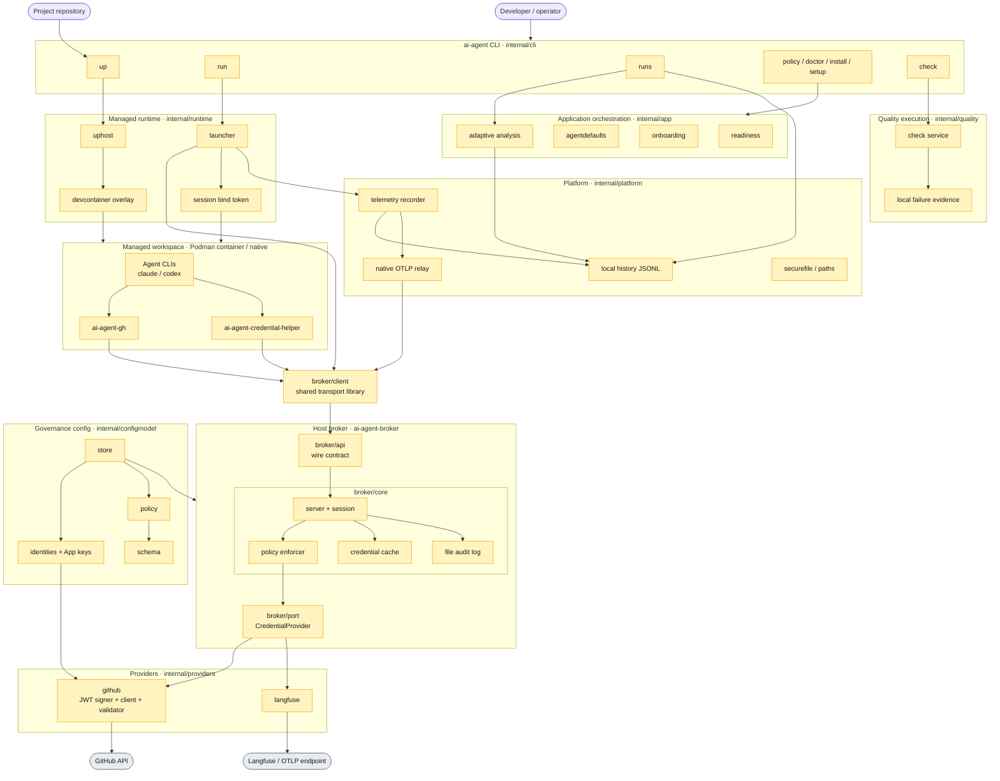
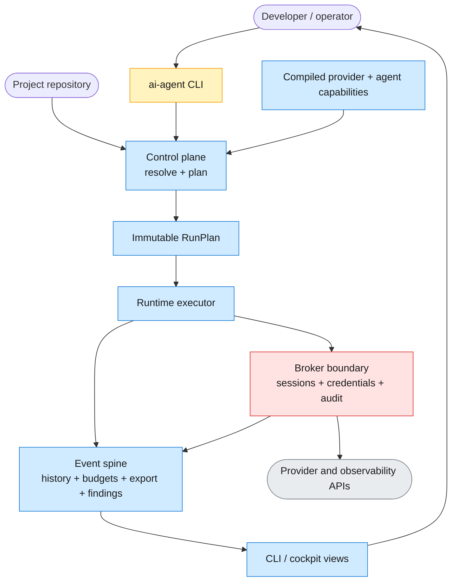

# Current and North-Star Architecture

AI Crew localdev is a local control plane for AI coding agents. Its architecture is organized around governed agent work: projects declare expectations, agents run in managed local environments, credentials are mediated by a host-side broker, quality is enforced by executable contracts, and telemetry feeds future workflow improvement.

This document states the core architecture characteristics and key decisions. Implementation mechanics, command behavior, tests, and operational details belong in code, ADRs, user docs, or runbooks.

## Architecture Layers

Yellow nodes exist today; blue nodes are north-star. Solid edges are implemented control paths; dashed edges are planned declaration, observation, or adaptive feedback paths. The two views below share one skeleton: the first shows the implemented system at package and binary granularity, the second extends it toward the north star.

### As of today

This view reflects what exists in `cmd/` and `internal/` today, with real binary and package names.

- One multi-call binary ships today: `ai-agent` dispatches on its invocation name to the CLI, the `ai-agent-broker` host daemon, and the two in-session shims `ai-agent-gh` and `ai-agent-credential-helper`, installed as symlinks to the single artifact.
- `ai-agent up` builds and enters a managed workspace through `uphost`, overlaying governance and toolchain access onto a project or generic devcontainer.
- `ai-agent run` uses `launcher` to create a broker session, mint a session bind token, start telemetry, and supervise the agent natively or in the container.
- Inside the workspace, agent CLIs never hold durable secrets: the `gh` shim and git credential helper call the broker over its Unix socket, authenticated by the session bind token.
- The broker is the governance boundary: `broker/api` is the wire contract, `broker/core` owns the server, session lifecycle, policy enforcement, credential cache, and audit log, and `broker/port` is the provider-generic seam. `broker/client` is a shared transport library linked into the CLI, launcher, and shims — not part of the daemon — and reaches the broker over its Unix socket.
- GitHub is the first provider — the host-side JWT signer mints short-lived App credentials against the GitHub API; Langfuse is a second provider behind the same seam.
- `ai-agent check` runs bounded commands through the `internal/quality` check service, which captures local failure evidence and classifies exit status; the CLI only parses flags and formats the result.
- Governance config (`identities` with App keys, `policy`, validated by `schema`) is loaded via `store` and consumed by the broker and providers.
- Managed runs emit local telemetry by default: a local JSONL history that `ai-agent runs` reads, including provider-reported Claude and Codex request usage collected through a loopback relay even when remote export is disabled. Langfuse trace delivery is optional. Telemetry is disableable and fails open, so it is not a durability guarantee; audit evidence, not telemetry, is the fail-closed record.
- `ai-agent runs analyze` invokes `internal/app/adaptive` over retained cross-project history. It emits deterministic coverage and cost summaries plus evidence-backed recommendations for recurring failures, retry waste, project-level high-token patterns, missing or lower-quality usage, and ratio-based weak verification. Its lookback, thresholds, evidence count, and finding count are explicit budgets, verification findings precede token-volume findings, and it never mutates projects or governance policy.
- Durable provider secrets never leave the broker process: the GitHub App private key stays inside the broker and only short-lived tokens leave, while the Langfuse project secret is read and used only by the broker-side telemetry-egress provider. The workspace receives only its scoped loopback relay token and broker session capability.

### North Star

The north star applies minimalism as a design principle: resolve intent once, produce a typed plan, execute that plan with strict boundaries, emit durable events, and render views from those events. The CLI is presentation, the control plane is planning, the runtime is execution, the broker is the secret and credential boundary, providers and agents are compiled capability modules, and events are the observability spine.

The control plane exists to remove decision-making from the CLI and execution path. `ai-agent run` should parse input and ask the control plane for a `RunPlan`; the executor should run that plan and emit events, not rediscover policy, provider rules, agent behavior, binary paths, model defaults, telemetry wiring, or verification contracts while the process is already underway.

The deployable shape stays deliberately small: one checksum-verified multi-call binary linked as the CLI, broker, and shims, plus optional managed runtime images or devcontainer Feature artifacts. The broker daemon is the only long-lived secret-bearing process; the CLI and shims are short-lived entrypoints that speak the broker API and never load durable provider credentials.

## RunPlan Contract

`RunPlan` is the central north-star contract. It is an immutable, fully resolved description of one managed run: repository, agent adapter, command, resources, broker session request, environment changes, interception plan, home or mount policy, network policy, telemetry sinks, token and cost budgets, quality contracts, retry policy, cleanup policy, and event correlation IDs.

Planning is fail-closed. If host governance, project manifest, environment, provider capabilities, or agent capabilities disagree, the planner returns a deterministic error before a broker session is created, a credential is minted, a workspace is changed, or an agent process starts.

Execution is intentionally mechanical. The executor creates the broker session, prepares the runtime boundary, starts event subscribers, launches the agent, runs quality contracts, finalizes state, revokes the session, and emits final events according to the plan. Any branch that changes security, lifecycle, persistence, budget, or egress behavior belongs in planning or in a named capability module, not as an inline launcher condition.

## Domain Boundaries

| Domain | Owns | Must not own |
|---|---|---|
| CLI | Flags, prompts, text and JSON presentation, exit-code mapping. | Policy semantics, provider wiring, agent-specific behavior, process supervision. |
| Control plane | Contract resolution, `RunPlan` construction, conflict handling, approval gates, lifecycle orchestration. | Durable secrets, provider SDK calls, raw command shims. |
| Broker | Session capabilities, peer checks, policy revalidation, credential minting, audit intent and result evidence, rate limits. | Project planning, adaptive advice, CLI presentation, agent UX. |
| Runtime | Workspace entry, process supervision, home or mount isolation, egress policy, tool interposition, cleanup. | Credential policy, provider credentials, project manifest schema. |
| Providers | Resource grammar, config schema, broker capability implementation, telemetry egress capability, interception declarations, readiness and setup hooks. | Control-plane orchestration, runtime-loaded plugins, CLI-only behavior. |
| Agents | Executable names, login-state projection or mounts, auth status probes, native telemetry wiring, model flag and env behavior, default guidance assets. | Provider credential minting, host governance policy. |
| Events | Append-only run facts, local history, live budget enforcement, export projection, adaptive finding persistence, operator views. | Secret storage, policy decisions that are not replayable from events. |

## Core Invariants

- One command path: a managed run goes through `resolve -> plan -> execute -> emit events -> render views`; no CLI or shim bypass recreates those decisions.
- One governance resolver: CLI, broker startup, readiness, setup, and planner use the same resolved identities, policy, manifest, and environment contract paths.
- One capability registry: provider implementations, provider validators, interception profiles, setup hooks, readiness hooks, and telemetry capabilities are registered in one compiled catalog; no duplicate provider lists exist in CLI, broker, launcher, or tests.
- One agent registry: Claude, Codex, and future agents declare executable matching, model extraction, native telemetry wiring, auth-state handling, and guidance assets through typed adapters; scattered string matching is migration debt.
- Broker stays small and strict: durable provider secrets never leave the broker process, every privileged provider action records durable audit intent before execution, and audit failure prevents the action.
- Runtime enforces the supported path: managed sessions receive only declared capabilities, declared mounts, declared tool interposition, and declared network egress; ambient personal credentials are not fallback mechanisms.
- Events are the source of operational truth: run history, token budgets, remote export, resource metrics, adaptive findings, and cockpit views consume the same run event stream and share stable run and task identifiers.
- Telemetry is not audit: telemetry may fail open for observability export, but budget enforcement and broker audit have deterministic local failure policies, and audit remains the fail-closed governance record.
- Project declarations are not enforcement by themselves: manifests declare intent, the control plane resolves intent, the runtime and broker enforce it, and tests prove the enforcement path.
- Extension is compile-time by default: adding a provider or agent means adding a capability module and registry entry, not loading runtime plugins inside the governance boundary.

## Guardrails

- No runtime-loaded plugins in the governance boundary. Shared objects, executable plugins, or project-supplied provider code are rejected because they make supply-chain audit and fail-closed security claims unfalsifiable.
- No raw provider credentials in workspaces. Agents receive scoped session capabilities, brokered command adapters, or short-lived provider outputs only when policy authorizes the exact resource.
- No ambient credential fallback. If brokered git, `gh`, provider telemetry, or provider command interception cannot be prepared, the managed run fails before execution or the tool fails closed during execution.
- No planning during execution. The executor may observe and react to planned events such as budget thresholds, signals, and verification outcomes, but it must not invent new resources, providers, credentials, contracts, or egress destinations.
- No silent manifest downgrade. Unknown or newer project declarations fail clearly unless the resolver has an explicit compatibility rule and executable coverage for the behavior.
- No unbounded evidence. Output, retained logs, telemetry payloads, findings, event size, retries, token budgets, and export queues have explicit budgets and deterministic overflow behavior.
- No hidden local mutation. Setup, install, `up`, and managed runs emit a plan or progress events for host changes, and any durable governance or audit write is atomic, owner-only, and recoverable.
- No duplicated security lists. Environment variables, scrub rules, intercepted commands, provider resources, and deployable aliases come from contracts or registries with dependency checks that reject local copies.
- No project-owned enforcement of host secrets. A project can request capabilities through its manifest, but host governance and broker policy decide whether those capabilities exist for the run.
- No retrospective-only budget policy. Provider-reported usage that arrives during a run feeds live warn and stop decisions; post-run analysis explains outcomes and trends but is not the first enforcement point.

## Minimal Deployables

| Deployable | Responsibility | Security posture |
|---|---|---|
| `ai-agent` | CLI, setup, planning entrypoint, views, and multi-call dispatch. | No durable provider secret handling outside broker mode. |
| `ai-agent-broker` | Host daemon for sessions, policy revalidation, credential minting, telemetry egress authorization, and audit. | Secret-bearing, small, fail-closed, owner-scoped Unix socket. |
| `ai-agent-gh` and `ai-agent-credential-helper` | Shim invocation names into the same binary for governed GitHub access. | Session-bound, no persistent auth writes, no fallback to personal credentials. |
| Managed runtime image or Feature | Optional portable workspace substrate for containerized execution. | Supplies toolchain and isolation defaults; does not own host governance secrets. |

Logical deployables are intentionally fewer than logical domains. Domains are code boundaries; deployables are operational surfaces. A small deployable set reduces installation friction, checksum surface, update complexity, and the number of places credentials could accidentally appear.

## Declaration versus Enforcement

The architecture separates declaration from enforcement. Host governance declares identities and provider policy, project manifests declare workflow intent, providers and agents declare capabilities, and the environment contract declares process-level names and resolution rules. The control plane resolves those declarations into a `RunPlan`; the broker and runtime enforce the plan; events record what happened.

Documentation and manifests do not close a security or lifecycle claim. A claim is complete only when code enforces it on the supported path and a focused automated check fails if the behavior regresses.

## Architecture Characteristics

| Characteristic | North-star meaning |
|---|---|
| Minimal | The system has one planning path, one provider registry, one agent registry, one event spine, and a small deployable set. |
| Secure by execution | Security defaults are enforced by broker, runtime, and planner behavior, not by operator memory or documentation. |
| Extensible | Providers and agents grow through compiled capabilities and typed contracts, not bespoke launcher branches or runtime plugins. |
| Simple UX | Operators use setup, up, run, and runs views; project-specific behavior comes from the resolved contract, not a large flag surface. |
| Observable | Every managed run emits bounded, correlated events that explain actions, budgets, checks, outcomes, and failures. |
| Adaptive | Recommendations persist in an outcome-tracked ledger and feed approved changes through the same manifest and planning path. |
| Lightweight | Custom edge-case handling moves out of long orchestration functions into reusable platform primitives, registries, and declarative capability adapters. |

## Layer Ownership

CLI packages own parsing and presentation. The control plane owns resolution, planning, approval gates, and orchestration. Broker core owns authorization and session decisions behind a stable transport contract. Runtime packages own execution boundaries, process lifecycle, and isolation. Provider adapters own provider-specific clients, signing, configuration, resource grammar, and payloads. Agent adapters own agent-specific login state, telemetry wiring, command matching, and model extraction. Event packages own append-only local history, live budget subscribers, export projection, adaptive ledgers, and views. These boundaries should be enforced by `scripts/check-dependencies.sh` and focused invariant tests.

Existing violations are migration work, not precedent. The engineering rules that keep this enforceable — self-documenting source, security and lifecycle claims proven by focused checks rather than prose, budgeted and fail-closed governance paths, durable audit evidence, and preserved user-facing behavior — are stated in `AGENTS.md` and recorded in the ADRs under `docs/decisions`.

## Key Decisions

- The broker is the credential and secret governance boundary. Project workflow intelligence belongs above it in the control plane, not inside it.
- The control plane plans; the runtime executes. `launcher` should shrink toward a plan executor instead of continuing to accumulate resolution, policy, provider, agent, telemetry, verification, and cleanup decisions.
- The broker API is credential-generic. GitHub is the first credential provider, Langfuse is the first telemetry-egress provider, and new providers join through the same compiled capability registry.
- Providers are compiled in, never loaded at runtime. The extension mechanism is the provider port contract plus one registry entry carrying resource grammar, validation, broker capability, interception profile, readiness hooks, and setup hooks.
- Agents are first-class capability modules. Claude and Codex behavior belongs in agent adapters, not scattered command-name checks, model heuristics, telemetry branches, or home-state special cases.
- Workspace interception is provider-declared and plan-scoped. Each provider defines environment variables to scrub, fail-closed environment to force, and commands to interpose; the planner selects the profiles required for the run and invariant tests prove each profile fails closed without ambient credentials.
- Signing and credential minting are host-side responsibilities. Containers and agents receive mediated access, not signing material.
- The trust model is single-user local workstation first. The architecture reduces blast radius for managed local agent work but does not claim protection from a fully compromised host user account.
- Managed sessions are fail-closed. If the governance boundary is unavailable, agent tooling fails rather than silently using ambient personal credentials.
- Personal agent CLI state is intentionally separate from governed repo credentials. Agent login state is projected or mounted only through the agent adapter and runtime policy; governed GitHub repo access remains brokered through `ai-agent run`, git credential helpers, and the `gh` wrapper.
- GitHub operations in managed sessions are HTTPS-first. SSH support requires a separate broker-enforced credential model before it can join the governed path.
- The managed runtime is an execution boundary, not just a convenience shell. Native home projection is a transitional confused-agent boundary; the mature path is runtime-owned isolation with explicit mounts, egress policy, and real-tool removal where supported.
- Project devcontainers are preserved as project-owned environments. AI Crew overlays governance and toolchain access without replacing a repository's own development environment.
- Project manifests are the north-star source of workflow intent. They describe allowed agents, credentials, services, secrets, caches, ports, approval points, budgets, and executable contracts, while host governance decides which requested capabilities are allowed.
- Quality gates are product contracts. They produce structured evidence that a run can use for retry, review, merge, or escalation decisions.
- Observability is built from durable run events. Screenshots, ad hoc logs, and manual notes are supporting evidence, not the source of truth.
- The meta-agent starts as the implemented advisory `runs analyze` layer. Expanding it to open PRs or modify manifests requires explicit policy and approval decisions.
- Adaptive findings are durable and outcome-tracked. Recommendations persist in an atomically written findings ledger with a stable fingerprint, acceptance status, and a metric snapshot at acceptance, so analysis reports measured deltas for accepted advice instead of repeating it.
- Resource budgets act during the run. Provider-reported usage that flows through the local relay feeds an explicit warn threshold and deterministic stop policy, not only retrospective reports.
- Any future LLM meta-agent consumes the bounded deterministic report, never raw telemetry history. The report's explicit budgets are the token budget of the analysis layer itself.
- Distribution moves toward portable artifacts or images. The target shape is a single static multi-call binary installed once with one checksum and linked as CLI, broker, and shims, plus optional runtime artifacts for managed workspaces.
- Telemetry decomposes by concern as it grows: event model, local history store, native relay, live budget subscriber, export projection, resource metrics, and adaptive ledger.
- Durable filesystem behavior is a platform primitive. Owner-only atomic writes, journals, locks, rotation, audit persistence, and recoverable state commits should share one small implementation instead of bespoke edge-case handling per feature.
- The design rule is to keep the broker small, strict, and auditable; keep the CLI thin; keep runtime execution mechanical; and put policy composition, planning, adaptation, and project workflow decisions in the control plane.
