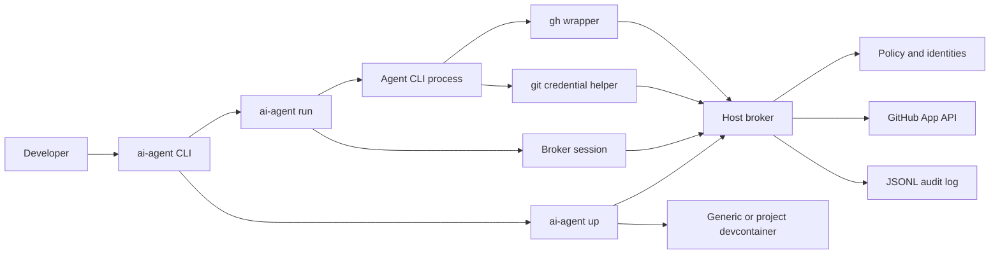
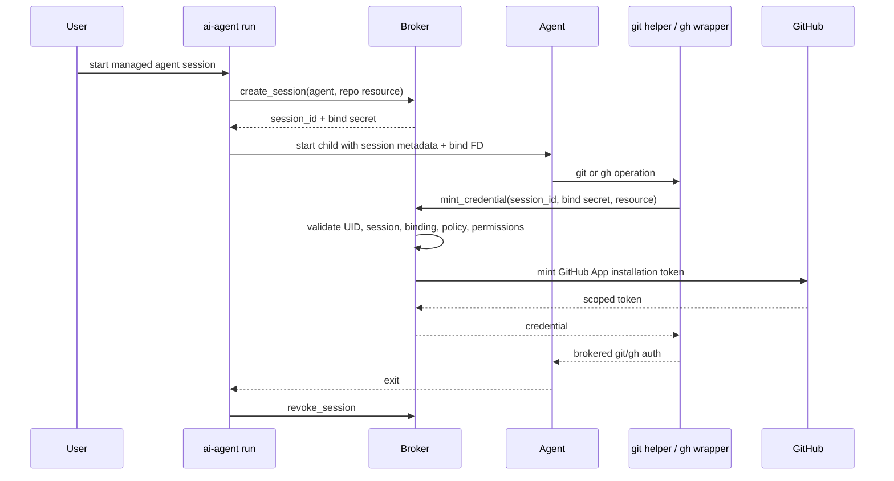
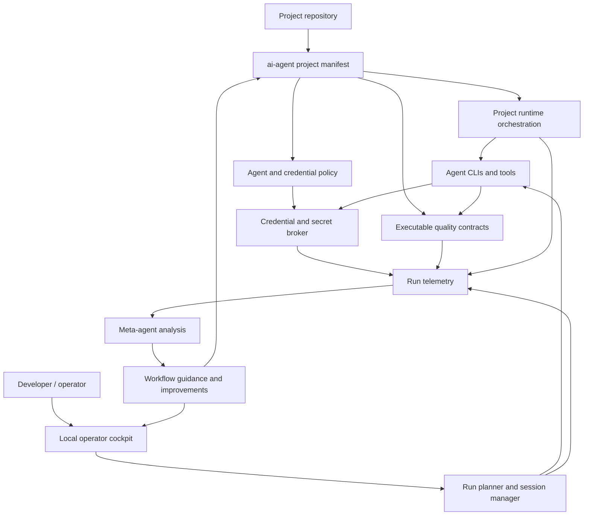

# Current and North-Star Architecture

This document describes AI Crew localdev at a high level: what exists today,
what the north-star architecture is aiming toward, and the decisions that shape
both. It is the source of truth for the auth boundary that was previously
described in a separate auth architecture note, while implementation details
still belong in code, tests, ADRs, or operational docs.

## Architecture Summary

AI Crew localdev is a local control plane for AI coding agents.

Today it provides a governed credential and devcontainer foundation: agents run
inside managed sessions, GitHub credentials are brokered by a host daemon,
policy is enforced on the broker side, and executable checks protect the core
auth and container flow.

The north star is broader: a local development environment where agents work
inside project-aware workflows, quality gates are executable contracts, and a
meta-agent layer learns from runs across projects to reduce waste, failures,
and cost.

## Current Architecture

Current responsibilities:

- `ai-agent up` prepares the local environment, starts or finds the broker, and
  launches either the generic devcontainer or a project-owned devcontainer with
  a broker/toolchain overlay.
- `ai-agent run` creates one managed session for one agent and repository,
  scrubs ambient credentials, configures fail-closed git behavior, shims `gh`
  when the wrapper is available on the toolchain path, supervises the agent
  process, and revokes the session on exit.
- The broker is the trust boundary for credential minting. It loads GitHub App
  signing keys, enforces policy, validates session binding, rate limits minting,
  and writes audit events.
- The devcontainer is an execution environment, not an authorization boundary.
  For authorization, it receives the broker runtime mount; signing material and
  PEM paths remain on the host.
- Quality enforcement is mostly repo-local today: Go tests, invariant tests,
  docs checks, readiness tests, ADR gates, semantic checks, and an ad hoc
  `ai-agent run --verify-cmd` retry loop.

## Current Auth Flow

The important property is that the agent does not receive GitHub App private
keys or long-lived credentials. Short-lived credentials are minted on demand and
are tied to broker-side session state.

## Auth Boundary

The supported auth model is a single-user Linux workstation running local AI
CLIs such as Codex, Claude Code, and Gemini CLI against GitHub SaaS
repositories over HTTPS. GitHub App identities are used for write operations
and PR creation. Local repositories may run host-native or bind-mounted inside
containerized development environments.

The brokered path is designed to address these failures:

- an agent reads or reuses long-lived auth material
- an expired token causes fallback to personal credentials
- one agent impersonates another by setting environment variables
- one repo session requests a token for a different repo
- a containerized agent reaches host signing material directly
- operational failures degrade into silent auth bypass

It does not claim to protect against a fully compromised host user account,
kernel compromise, mutually untrusted same-UID host processes outside the
brokered workflow, or replaced local shims and helper binaries. The trusted
local components are the `ai-agent` launcher, broker binary, git credential
helper, and `gh` wrapper once installed.

## Brokered Auth Contract

The broker is the trust boundary for credential minting:

- GitHub App PEM material is loaded into the broker process only.
- Agents and containers receive the broker socket, not signing keys or PEM
  paths.
- The broker does not trust caller-provided `AGENT_IDENTITY`, repo slug, host
  path, current working directory, or arbitrary helper JSON as authorization
  input by itself.
- Each minted token is attributable to a broker-issued session, allowed repo,
  and requested permission set.
- Tokens are short-lived and minted on demand. The broker may cache tokens in
  memory with a TTL shorter than token expiry, but no persistent credential
  cache is enabled by default.
- Policy is enforced host-side, not in wrappers alone.
- The broker validates the connecting UID with `SO_PEERCRED` or equivalent on
  every local socket connection and rejects unexpected UIDs.
- `git` and `gh` fail closed when the broker or session binding is unavailable.

Session binding is deliberately outside the environment. The launcher creates a
per-session random binding secret, passes it to the child process through an
inherited file descriptor, and registers only the secret hash with broker
session state. Helpers and wrappers reopen `/proc/self/fd/$AI_AGENT_SESSION_BIND_FD`
so repeated `git` and `gh` invocations get independent read offsets. On Linux,
the backing object is a sealed `memfd_create` file or equivalent tmpfs fallback.
Non-Linux ports must preserve the same properties: per-session randomness, no
environment exposure, repeatable reads, and broker-side validation.

For phase 1, sessions are single-repo. A token mint succeeds only when the
socket peer UID is expected, the session is live, the binding secret matches,
and the requested repo and permission set match broker-side policy. Revocation
and status operations authorize by same-UID socket ownership rather than by the
binding secret, so the secret is never persisted in session files.

Repository attribution is also broker-side. The launcher resolves the repo at
session creation, the broker binds the session to that repo, `git` requests are
checked against the active remote URL, and `gh -R owner/repo` is accepted only
as a consistency check against the session-bound repo. The broker must never
mint a token merely because a helper sent `"repo":"owner/name"`.

## Git And `gh`

`git` integration uses a credential helper only as transport from git to the
broker. The helper reads git credential input, resolves host and repo context
where possible, presents the broker session binding, and returns an ephemeral
GitHub App installation token. It never has PEM material and never stores
credentials on disk.

`gh` requires a wrapper because it does not use git credential helpers. The
wrapper clears ambient `GH_TOKEN` and `GITHUB_TOKEN`, asks the broker to mint a
repo-scoped token for the forwarded argument vector, and sets token environment
variables only for the real `gh` child process. The broker extracts only
`-R owner/repo` from those arguments for repo consistency; it does not perform
full `gh` parsing.

The wrapper fails when the repo is ambiguous, outside the session allowlist, or
inconsistent with the current repo remote. In the generic devcontainer and a
complete installed toolchain, the real `gh` binary is kept off the managed
command path so plain `gh` resolves to the brokered wrapper.

## Fail-Closed Credential Controls

Managed sessions remove or override credential sources that could bypass the
broker:

- GitHub token variables such as `GH_TOKEN`, `GITHUB_TOKEN`, and enterprise
  variants
- `GH_HOST`
- local `http.<url>.extraheader`
- local, global, and system git credential helpers
- `GIT_ASKPASS` and `SSH_ASKPASS`
- stored `gh` authentication
- `.netrc`
- HTTPS URLs embedding credentials
- `SSH_AUTH_SOCK`, `GIT_SSH`, and `GIT_SSH_COMMAND`
- SSH remotes for managed sessions, because phase 1 is HTTPS-only

The launcher force-sets `GIT_TERMINAL_PROMPT=0` so git cannot fall back to
interactive prompts when the broker is unavailable. Git config is applied
process-locally through environment-backed config such as `GIT_CONFIG_COUNT`,
not by mutating repository config. Denied credential requests are audit events,
not just errors.

## North-Star Architecture

North-star responsibilities:

- Projects declare how agents are allowed to work: agents, credentials,
  services, secrets, caches, ports, approval points, and executable contracts.
- The runtime provisions project-specific development environments without
  baking secrets into images or relying on source-built host binaries.
- The broker generalizes beyond GitHub credentials into a governed local secret
  and credential boundary.
- The operator cockpit shows active runs, approvals, diffs, checks, traces,
  token spend, resource use, and failure patterns.
- The meta-agent layer analyzes run telemetry across projects and recommends
  concrete improvements to workflows, prompts, contracts, models, and tooling.

## Core Architecture Characteristics

| Characteristic | Current state | North-star direction |
|---|---|---|
| Governed | Broker sessions and repo-scoped GitHub policy govern the supported auth path. | Project manifests govern full workflows: credentials, contracts, services, approvals, and run modes. |
| Secure by default | Signing keys stay on the host; agents use brokered credentials on the managed path. | Clearer enforcement boundary for confused or adversarial agents, including isolated state, egress controls, and mediated secret access where needed. |
| Simple to use | `setup`, `install`, `up`, and `run` exist, but still require source-built tooling. | Clean-host install, portable toolchain delivery, persistent re-entry, and project-first commands. |
| Contract-driven | Repo tests and readiness checks protect the broker/container foundation. | Every project has executable contracts with structured outcomes and retry guidance. |
| Observable | Broker JSONL audit records auth events. Langfuse deployment is available as infrastructure. | Run-level telemetry connects auth, agent actions, verification, cost, tokens, resources, and outcomes. |
| Adaptive | Token caching reduces repeated credential minting. | A meta-agent detects repeated failures, waste, idle loops, bad model choices, and weak project contracts. |

## Key Decisions

### Explicit Decisions

- The broker API is credential-generic, not GitHub-specific. New credential
  types should be added as providers behind `mint_credential`, not as separate
  ad hoc paths. See ADR 0001.
- Session binding secrets are required for credential minting but are not
  persisted in session files. Lifecycle operations use same-UID socket
  ownership. See ADR 0002.
- The launcher supervises the agent process so it can revoke sessions on exit
  and propagate the agent exit code after cleanup.
- In the generic devcontainer and complete installed toolchain path, the real
  `gh` binary is kept off the managed command path. Plain `gh` invocations route
  through the brokered wrapper there. Host-native wrapping depends on
  `ai-agent-gh` being installed or explicitly configured.
- The broker is host-side. Containers receive the broker socket, not signing
  keys or PEM paths.
- Phase 1 sessions are bound to exactly one repo. Multi-repo automation needs a
  later explicit allowlist design.
- Managed sessions are HTTPS-only for GitHub operations. SSH support would need
  a separate broker-enforced credential model before it can be supported.
- Linux and GitHub are the required phase 1 platform and provider. macOS,
  Windows, and additional providers are later portability work.
- JWT signing lives inside the broker process rather than a separate signer
  daemon. In the single-user model, separating same-UID broker and signer
  daemons does not create a meaningful security boundary.
- `devcontainer.json` is the canonical container setup mechanism. Developers
  launch the devcontainer, then run `ai-agent run` inside it for managed
  sessions.

### Implicit Decisions

- The supported trust model is single-user local workstation first. The broker
  rejects other UIDs, but it does not claim protection from a fully compromised
  same-UID host process.
- The devcontainer improves packaging, repeatability, and operational safety,
  but it is not the primary security boundary.
- The supported path is fail-closed. When the broker or session binding is
  unavailable, git and `gh` should fail rather than fall back to personal auth.
- Project devcontainer support currently overlays broker access onto a
  repository-owned environment instead of replacing that environment.
- Local quality gates are treated as executable product contracts, not just CI
  hygiene.
- Observability should be built from durable run and auth events, not from
  screenshots, logs, or manual post-run notes alone.

## Current Boundaries

The current architecture can support secure brokered GitHub work for managed
sessions. It cannot yet guarantee that every possible command an agent runs is
policy-mediated. Agents can still execute arbitrary project tools and raw
network clients unless future runtime controls restrict that.

The generic devcontainer has a persistent home volume for agent CLI state.
Provisioning that state and separating personal agent CLI login state from
governed repository credentials are still open product problems.

The broker can audit credential activity, but it cannot yet explain total agent
cost, token spend, model choice, wall-clock waste, or recurring failure
patterns. Those require run-level telemetry above the broker.

Project devcontainer support proves that broker access can be injected into a
repository-owned environment. It does not yet provide portable toolchain
installation, broker-mediated secrets, cache declarations, or full service
policy.

The auth boundary is strong for the supported `ai-agent run` path, but it is
not complete containment. Agents can still use raw network clients,
project-provided binaries, or other reachable tools unless future runtime
controls mediate those paths.

## Decision Pressure Points

These are the architecture decisions that should be resolved before major new
features are added:

1. Enforcement boundary: accidental misuse only, or stronger containment for
   intentionally bypassing agents?
2. Distribution shape: release artifacts, package repository, published image,
   devcontainer Feature, or a combination?
3. Project manifest shape: which project workflow concerns belong in
   `ai-agent` instead of the repository's own devcontainer?
4. Telemetry identity: what is the stable run ID that connects broker events,
   agent actions, contract results, token spend, and resource use?
5. Meta-agent authority: should the meta-agent only recommend changes, or can
   it open PRs and modify project manifests under policy?

## Design Rule

Keep the broker small, strict, and auditable. Put project workflow intelligence
above it, not inside it. The broker should answer "may this session receive this
credential?" The workflow layer should answer "what should the agent do next,
how should quality be proven, and what should improve next time?"

## Sources

- [GitHub App JWT validity][GH_JWT]
- [GitHub App installation token TTL and permission scoping][GH_INSTALL_TOKEN]
- [Git credential protocol][GIT_CREDENTIAL]
- [Evidence that `extraheader` auth can bypass credential helpers][EXTRAHEADER_ISSUE]
- [GitHub REST API rate limits for GitHub App installations][GH_RATE_LIMITS]
- [`SO_PEERCRED` Unix socket peer credentials][SO_PEERCRED]
- [`memfd_create` anonymous file support][MEMFD_CREATE]
- [Podman machine platform model][PODMAN_MACHINE]

[GH_JWT]: https://docs.github.com/en/apps/creating-github-apps/authenticating-with-a-github-app/generating-a-json-web-token-jwt-for-a-github-app
[GH_INSTALL_TOKEN]: https://docs.github.com/en/apps/creating-github-apps/authenticating-with-a-github-app/authenticating-as-a-github-app-installation
[GIT_CREDENTIAL]: https://git-scm.com/docs/git-credential
[EXTRAHEADER_ISSUE]: https://github.com/actions/checkout/issues/162
[GH_RATE_LIMITS]: https://docs.github.com/en/rest/using-the-rest-api/rate-limits-for-the-rest-api
[SO_PEERCRED]: https://man7.org/linux/man-pages/man7/unix.7.html
[MEMFD_CREATE]: https://man7.org/linux/man-pages/man2/memfd_create.2.html
[PODMAN_MACHINE]: https://docs.podman.io/en/latest/markdown/podman-machine.1.html
