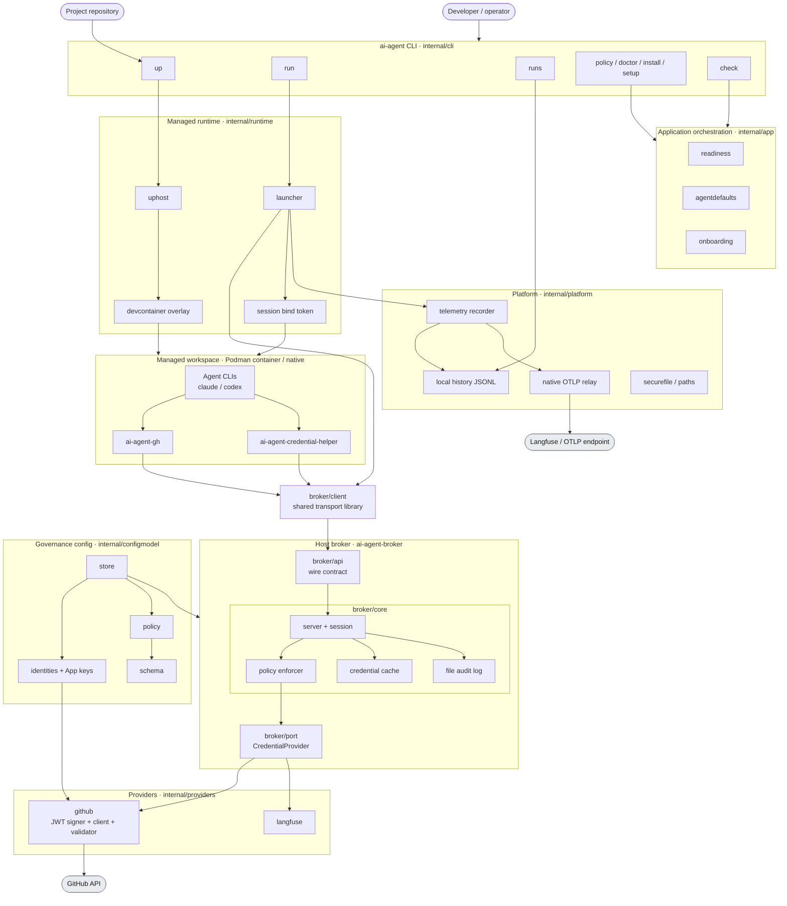
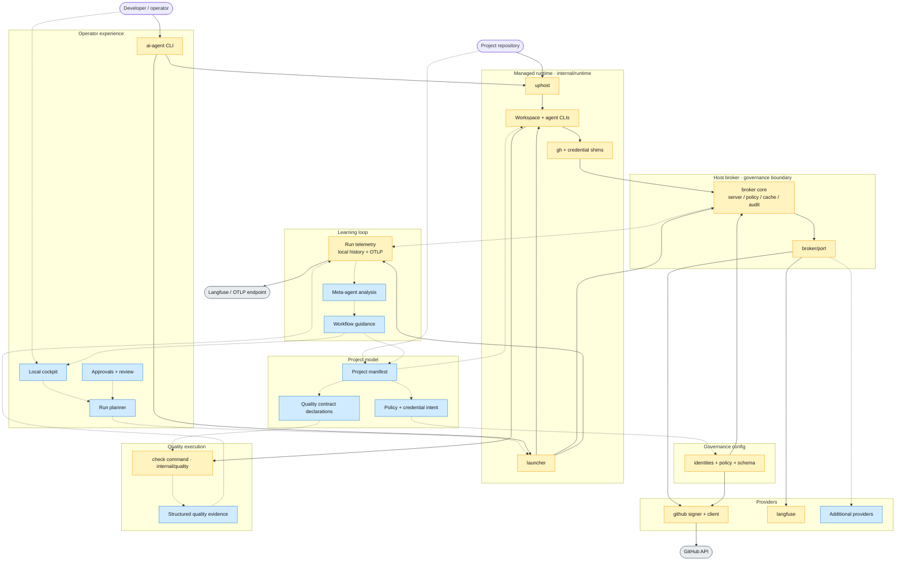

# Current and North-Star Architecture

AI Crew localdev is a local control plane for AI coding agents. Its architecture is organized around governed agent work: projects declare expectations, agents run in managed local environments, credentials are mediated by a host-side broker, quality is enforced by executable contracts, and telemetry feeds future workflow improvement.

This document states the core architecture characteristics and key decisions. Implementation mechanics, command behavior, tests, and operational details belong in code, ADRs, user docs, or runbooks.

## Architecture Layers

Yellow nodes exist today; blue nodes are north-star. Solid edges are implemented control paths; dashed edges are planned declaration, observation, or adaptive feedback paths. The two views below share one skeleton: the first shows the implemented system at package and binary granularity, the second extends it toward the north star.

### As of today

This view reflects what exists in `cmd/` and `internal/` today, with real binary and package names.

- Four binaries ship today: `ai-agent` (CLI), `ai-agent-broker` (host daemon), and two in-session shims, `ai-agent-gh` and `ai-agent-credential-helper`.
- `ai-agent up` builds and enters a managed workspace through `uphost`, overlaying governance and toolchain access onto a project or generic devcontainer.
- `ai-agent run` uses `launcher` to create a broker session, mint a session bind token, start telemetry, and supervise the agent natively or in the container.
- Inside the workspace, agent CLIs never hold durable secrets: the `gh` shim and git credential helper call the broker over its Unix socket, authenticated by the session bind token.
- The broker is the governance boundary: `broker/api` is the wire contract, `broker/core` owns the server, session lifecycle, policy enforcement, credential cache, and audit log, and `broker/port` is the provider-generic seam. `broker/client` is a shared transport library linked into the CLI, launcher, and shims — not part of the daemon — and reaches the broker over its Unix socket.
- GitHub is the first provider — the host-side JWT signer mints short-lived App credentials against the GitHub API; Langfuse is a second provider behind the same seam.
- Governance config (`identities` with App keys, `policy`, validated by `schema`) is loaded via `store` and consumed by the broker and providers.
- Every run emits durable telemetry: a local JSONL history that `ai-agent runs` reads, plus an optional native OTLP relay to a Langfuse/OTLP endpoint.
- Durable secrets never reach the workspace: the GitHub App private key stays inside the broker and only short-lived tokens leave, while the Langfuse project secret stays host-side in the launcher's OTLP relay and the workspace receives only a scoped relay token. The Langfuse secret still crosses from the broker to the host-side launcher (same single-user trust domain); moving that egress into the broker is tracked in issue #73.

### North star

Same system extended toward the north star. Yellow nodes and solid edges exist today; blue nodes and dashed edges are planned and consume the existing runtime, broker, and telemetry rather than moving governance into project code.

- Operator experience: a local cockpit, a run planner, and explicit approval and review points sit above the CLI and drive runs, rather than every run being a raw `ai-agent run` invocation.
- Project model: a project manifest becomes the source of workflow truth, declaring policy and credential intent (feeding host policy) and quality contract declarations (feeding checks) instead of these living only in host config.
- Providers: the provider-generic `broker/port` seam gains additional providers beyond GitHub and Langfuse under the same governance model.
- Quality execution: today's `check` command grows into structured quality evidence with outcomes and retry guidance that a run can act on.
- Learning loop: durable run telemetry feeds a meta-agent that produces workflow guidance, which flows back into the manifest and cockpit, closing the adaptive loop.

The current control path is CLI driven: `ai-agent up` enters a managed workspace, `ai-agent run` creates broker sessions, emits durable run telemetry, and agents request brokered credentials while optionally running repo-local checks. Operators inspect canonical local summaries with `ai-agent runs` and can export the same lifecycle through OTLP. The north-star layers add a cockpit, planner, project manifest, structured contract declarations, dashboards, and adaptive telemetry analysis; those pieces should consume the existing runtime and governance boundary rather than move policy enforcement into project code.

## Declaration versus Enforcement

The architecture separates declaration from enforcement. Project repositories supply runtime inputs today, but they do not enforce governance or own structured quality contracts; runtime asks the governance boundary for credentials and invokes quality checks. The broker remains the governance boundary, project mode preserves a repository-owned devcontainer under a read-only broker and toolchain overlay, and quality runs through repo-local checks or `--verify-cmd`. The architectural gap is that governance declarations and quality contracts are not yet first-class project-manifest concepts; north-star project manifests will declare the policy intents and executable contracts those domains consume.

## Core Architecture Characteristics

| Characteristic | Architecture meaning | North-star direction |
|---|---|---|
| Governed | Agent work is mediated by explicit project, identity, credential, and approval policy. | Project manifests govern complete workflows, not only repository credentials. |
| Secure by default | Sensitive credentials and secrets stay behind a local governance boundary. | Agents receive mediated access to capabilities instead of direct access to durable secrets. |
| Project-aware | Runtime behavior is derived from the project being worked on. | Projects declare agents, services, caches, ports, secrets, contracts, and approval points. |
| Simple to enter | A developer should be able to enter a usable managed workspace without rebuilding the system mentally. | Installation, project startup, agent login, and re-entry become repeatable product flows. |
| Contract-driven | Quality is represented as executable evidence, not manual convention. | Every project has structured quality contracts with clear outcomes and retry guidance. |
| Observable | Runs produce durable events that explain what happened and why. | Auth, agent actions, checks, cost, tokens, resources, and outcomes share a stable run identity. |
| Adaptive | The system learns from repeated work rather than treating each run as isolated. | A meta-agent identifies waste, recurring failures, weak contracts, and better workflow defaults. |

## Layer Ownership

CLI packages own parsing and presentation. Application use cases own workflow orchestration. Broker core owns authorization and session decisions behind a stable transport contract. Provider adapters own provider-specific clients, signing, configuration, and payloads. Telemetry sinks own transport encoding, while telemetry policy owns the single export allowlist. These layers map to the `internal/` packages and are enforced by `scripts/check-dependencies.sh`, which rejects forbidden imports in local verification and CI.

The engineering rules that keep this enforceable — self-documenting source, security and lifecycle claims proven by focused checks rather than prose, budgeted and fail-closed governance paths, durable audit evidence, and preserved user-facing behavior — are stated in `AGENTS.md` and recorded in the ADRs under `docs/decisions`. Existing violations are migration work, not precedent.

## Key Decisions

- The broker is the credential and secret governance boundary. Project workflow intelligence belongs above it, not inside it.
- The broker API is credential-generic. GitHub is the first provider, but new credential types should be added as providers behind the same governance model.
- Signing and credential minting are host-side responsibilities. Containers and agents receive mediated access, not signing material.
- The trust model is single-user local workstation first. The architecture reduces blast radius for managed local agent work but does not claim protection from a fully compromised host user account.
- Managed sessions are fail-closed. If the governance boundary is unavailable, agent tooling should fail rather than silently use ambient personal credentials.
- Personal agent CLI state is intentionally separate from governed repo credentials. The generic devcontainer persists agent login and config under `/home/dev` in the `ai-agent-home` volume; GitHub repo access remains brokered through `ai-agent run`, git credential helpers, and the `gh` wrapper. Codex login reuse is tested with the real CLI; Claude OAuth reuse still needs provider-backed validation.
- Phase 1 sessions are single-repository. Multi-repository work needs an explicit allowlist model before it becomes a first-class workflow.
- GitHub operations in managed sessions are HTTPS-first. SSH support requires a separate broker-enforced credential model before it can join the governed path.
- The managed runtime is an execution environment, not the primary security boundary. Stronger containment, egress policy, and isolated state are future runtime decisions.
- Project devcontainers are preserved as project-owned environments. AI Crew should overlay governance and toolchain access without replacing a repository's own development environment.
- Project manifests are the north-star source of workflow truth. They should describe allowed agents, credentials, services, secrets, caches, ports, approval points, and executable contracts.
- Quality gates are product contracts. They should produce structured evidence that a run can use for retry, review, merge, or escalation decisions.
- Observability is built from durable run events. Screenshots, ad hoc logs, and manual notes are supporting evidence, not the source of truth.
- The meta-agent should start as an advisory layer. Expanding it to open PRs or modify manifests requires explicit policy and approval decisions.
- Distribution should move toward portable artifacts or images. Requiring a source checkout and local build is not the north-star user experience.
- The design rule is to keep the broker small, strict, and auditable while placing planning, adaptation, and project workflow behavior in higher layers.
