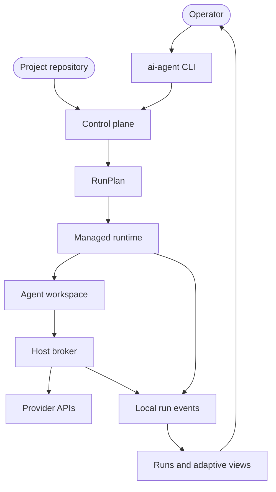
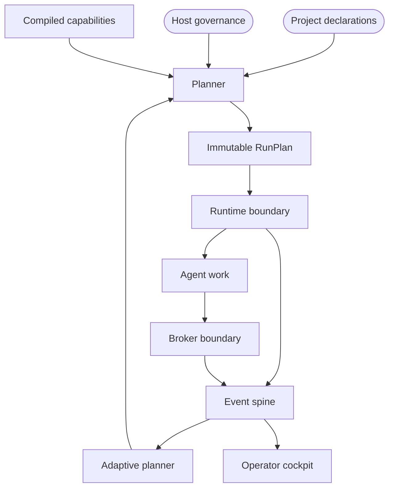

# Current and North-Star Architecture

AI Crew localdev is a local control plane for AI coding agents. It keeps durable provider secrets on the host, runs agents through governed local workspaces, turns project and host declarations into an executable run plan, records bounded run evidence, and uses that evidence to improve workflows over time.

This document is the architecture source of truth. It intentionally avoids package inventories, command flag tables, migration trackers, and low-level implementation mechanics that are visible in code.

## Current Architecture

The current product is a governed local substrate, not a fully autonomous development system.

- The CLI owns presentation: flags, prompts, text and JSON output, and exit-code mapping. It should translate operator input into application requests and render results.
- The control plane owns resolution: project manifest intent, repository identity, agent capability, provider resources, brokered secret resource bindings, quality contracts, token budgets, telemetry sinks, retry policy, cleanup policy, and correlation identifiers are resolved into a `RunPlan` before side effects begin.
- The runtime owns execution: it prepares the supported workspace boundary, starts planned telemetry and budget observers, supervises the agent, runs planned quality contracts, finalizes projected state, and cleans up according to the plan.
- The broker owns secrets and governance enforcement: durable provider credentials stay host-side, privileged provider actions are policy-checked and audited, and managed workspaces receive only scoped session capabilities.
- Providers and agents are compiled capability surfaces, not runtime plugins. Providers declare resource grammar, policy validation, broker behavior, telemetry egress, readiness/setup requirements, and interception behavior. Agents declare executable matching, auth-state handling, model attribution, native telemetry support, and default guidance assets.
- Events are the operational record for managed runs: local history, verification outcomes, budget threshold events, usage, optional export projection, and adaptive findings are derived from bounded event evidence.
- The supported managed-run path is container-only. Native host execution for managed runs fails closed.

## North-Star Architecture

The north star is an autonomous, efficient, adaptive local development environment. Projects declare expected work, the control plane plans agent execution, the runtime and broker enforce the plan, quality contracts decide completion, and event-derived feedback improves future work.

In the north star, there is one path for governed work: declare intent, resolve a plan, execute the plan, emit bounded evidence, render views, and feed approved improvements back through declarations. The executor does not rediscover policy, providers, agents, credentials, budgets, or quality contracts while a run is already underway.

## Domain Ownership

| Domain | Owns | Must not own |
|---|---|---|
| CLI | Operator interaction, presentation, exit mapping. | Policy semantics, provider wiring, agent behavior, process supervision. |
| Control plane | Contract resolution, `RunPlan` construction, lifecycle policy, conflict handling. | Durable secrets, provider SDK calls, raw workspace tools. |
| Runtime | Workspace boundary, process lifecycle, planned interception, home/state projection, cleanup. | Credential minting, host governance policy, project schema ownership. |
| Broker | Session capabilities, peer checks, policy revalidation, credential minting, provider egress authorization, durable audit evidence. | Project planning, CLI UX, adaptive advice. |
| Providers | Resource grammar, provider config, broker capability implementation, telemetry egress, setup/readiness declarations, interception declarations. | Control-plane orchestration, runtime-loaded plugin behavior. |
| Agents | Executable matching, login-state handling, auth probes, native telemetry support, model attribution, guidance assets. | Provider credential minting, host governance policy. |
| Events and adaptive layer | Append-only run facts, local history, budget evidence, export projection, adaptive finding persistence, operator views. | Secret storage, non-replayable policy decisions. |

## Core Invariants

- Planning fails before privileged side effects. Invalid governance, project intent, provider resources, agent/tool binding, budgets, or runtime requirements must stop before broker session creation, credential minting, workspace mutation, or agent launch.
- Brokered access fails closed. If scoped broker access, audit evidence, planned interception, or session binding cannot be prepared, managed work must not fall back to personal credentials.
- Telemetry is not audit. Optional export may fail without failing the run, but broker audit and hard budget enforcement have deterministic local failure policies.
- Evidence is bounded. Output, retained logs, event size, telemetry payloads, findings, retries, budget thresholds, and export queues have explicit budgets and deterministic overflow behavior.
- Declarations are not enforcement. Host governance, project manifests, provider capabilities, and agent capabilities become enforceable only after code resolves and applies them on the supported path.
- Extension is compiled and reviewed. Providers and agents join through typed capability modules and registry entries, not runtime-loaded plugins inside the governance boundary.
- The deployable surface stays small. One multi-call binary covers the CLI, broker, and shims; optional runtime artifacts provide workspace substrate but do not own host governance secrets.

## Current Gap To North Star

The heavy CLI to control-plane migration for managed runs is effectively complete. Current gaps are product capability and simplification gaps, not a need to keep migration trackers alive.

| Area | Current state | North-star delta |
|---|---|---|
| Project declarations | Manifests declare allowed agents, configured-tool binding, model attribution defaults, quality contracts, brokered resources, brokered secret resource bindings, caches, services, ports, approvals, run modes, and token resource budgets. Managed runs and `up --project` enforce the supported declarations before privileged side effects. | Declarations expand beyond the supported operating-model surface into autonomous workflow intent and accepted adaptive changes. |
| Runtime containment | Managed runs hide personal home-relative credential state, enforce brokered tools on the supported path, and refuse host-native execution. The explicit containment claim is brokered credential containment for a single-user workstation, not adversarial process containment. | Stronger sandboxing remains future capability: network egress policy, real-tool removal, per-run user namespaces, or equivalent isolation. |
| Adaptive loop | Run history, usage, budget evidence, recommendations, and finding status are local and durable. | Accepted recommendations create governed changes and later analysis measures whether they improved cost, quality, or reliability. |
| Operator experience | Setup and `up` guide the common path; `up` runs agent login status before opening the shell, and release smoke covers install, setup, broker, doctor, container entry, persisted login recognition, and a brokered managed run. | Provider signup and browser/OAuth agent login remain operator-owned external steps. |
| Workflow autonomy | Runs are operator-triggered and quality contracts can retry or fail runs. | A policy-gated planner can schedule work, choose context and tools, request approvals, open reviewable changes, merge when allowed, and remediate failures. |
| Views | CLI run views and adaptive reports exist. | A compact local cockpit shows active work, spend, failures, quality status, and accepted recommendation outcomes without raw event inspection. |

## Key Decisions

- The broker is the secret and credential boundary; project intelligence belongs above it in the control plane.
- `RunPlan` is the handoff between planning and execution; runtime behavior should be mechanical and plan-driven.
- Managed work is container-only; native host execution is rejected before brokered work begins.
- Provider and agent extensibility is compile-time by default.
- Project manifests are the source of workflow intent, but host governance decides whether requested capabilities are allowed.
- Quality gates are product contracts, not best-effort scripts.
- Live resource budgets act during the run; post-run analysis explains trends and outcomes.
- Adaptive recommendations remain advisory until accepted changes flow back through governed project declarations and approval policy.
- Documentation records architecture intent; code, tests, hooks, broker policy, and runtime behavior enforce important claims.
