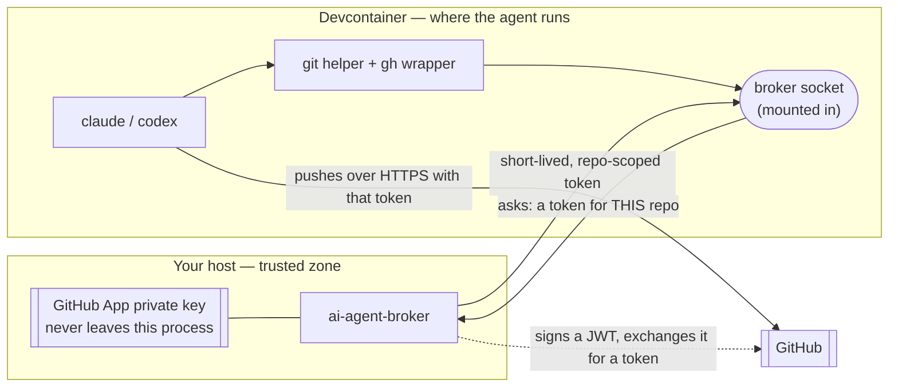

# AI Crew Localdev — User Manual

Run Claude Code or Codex against your GitHub repos **without ever handing them a credential**.

The agent gets a short-lived token, scoped to one repo, minted on demand by a broker that runs on your host. Your GitHub App private key stays in that broker process. The agent — and anything it spawns — never sees it.

**Start here**: do the [Quick Start](#quick-start), then read [How it works](#how-it-works) so you know why each step exists. Deeper detail lives in the docs listed at the [bottom](#where-to-go-next).

---

## Quick Start

### What you need

- Linux, with `git` and repos using **HTTPS remotes** (SSH remotes are not supported)
- **Podman** (preferred) or Docker
- **Node.js** — for the devcontainer CLI, which `ai-agent up` offers to install for you

### 1. Create a GitHub App (once)

The broker mints tokens from a GitHub App, so you need one before anything else.

**GitHub → Settings → Developer settings → GitHub Apps → New GitHub App**, then:

- Uncheck **Webhook → Active**
- Permissions: `Contents` **Read & write**, `Pull requests` **Read & write**, `Metadata` **Read-only**
- Create it, **generate a private key**, and download the `.pem`
- **Install** the app on the repos your agent should touch

Keep the key private:

```bash
mkdir -p ~/.config/ai-agent
mv ~/Downloads/*.private-key.pem ~/.config/ai-agent/claude-app-key.pem
chmod 600 ~/.config/ai-agent/claude-app-key.pem
```

### 2. Install

```bash
curl -fsSLO https://github.com/maryzam/ai-crew-localdev/releases/latest/download/install.sh
sh install.sh latest
```

That installs one self-contained binary to `~/.local/bin` (checksum-verified). No clone needed — the devcontainer definition ships inside the binary. To build from source instead: `git clone`, then `make install`.

### 3. Start everything

```bash
ai-agent up --workspace ~/github
```

`--workspace` points at the directory holding *your* repos; it gets mounted at `/workspace` inside the container. Run it from anywhere.

On the first run there is no config yet, so `ai-agent up` offers guided setup. Accept it. It asks for the agent name (e.g. `claude`), the App ID, the path to your PEM, and a git author identity — then queries GitHub, lists the repos your App can reach, and lets you pick which ones this agent may access. It writes `identities.json` and `policy.json` for you and continues booting.

From there `ai-agent up` starts the broker, runs readiness checks, launches the devcontainer, and drops you into a shell in it.

### 4. Run an agent

Inside that shell:

```bash
ai-agent run --agent claude --repo /workspace/my-project -- claude
```

The `--` is required; everything after it is the agent's own command.

Sign in to Claude (or Codex) when it asks. That login is stored in `/home/dev`, a persistent volume, so you only do it once — it survives container restarts and even container replacement. It has nothing to do with GitHub access, which stays brokered.

Now let the agent work. Inside the session, `git push` and `gh pr create` authenticate on their own, against the repos you allowed and no others.

**Do not run `gh auth login` in the container.** You don't need it, and the managed `gh` wrapper rejects it.

---

## How it works

### One `git push`, end to end

```
  agent runs:  git push origin main
       │
       ▼
  git needs a password, so it calls its configured credential helper
       │
       ▼
  ai-agent-credential-helper ──── unix socket ────► ai-agent-broker  (on your host)
       │                                                   │
       │                                    1. Is this session still alive?
       │                                    2. Is this repo in this agent's policy?
       │                                    3. Sign a JWT with the App key, exchange it
       │                                       for a GitHub installation token
       │                                       (~1 hour, this repo only)
       │                                    4. Append an audit line
       │                                                   │
       ◄──────────────── short-lived token ────────────────┘
       │
       ▼
  git pushes over HTTPS with that token — and never stores it

  Broker unreachable, session revoked, or repo not in policy?
       └──► git fails loudly. It never falls back to your personal credentials.
```

`gh` works the same way: in a managed session the only `gh` on `PATH` is a wrapper that clears any inherited `GH_TOKEN`, requests a fresh brokered token, and passes it only to the real `gh` child process.

### The trust boundary at a glance

The private key lives in one process on your host. The container the agent runs in only ever gets a socket and a short-lived token — never the key.



Everything the agent can touch is inside the dashed-in container box: the workspace, the socket, and whatever token it was just handed. The key, the policy decision, and the audit log stay on the host side of the boundary, where the agent cannot reach them.

### Why it is built this way

**The private key lives in exactly one process.** A GitHub App PEM signs tokens for *every* repo the App is installed on. If an agent could read it, a stray `cat`, a prompt injection, or a bad `npm` postinstall could exfiltrate access to all of them, permanently. The broker holds the PEM; agents hold tokens that expire.

**Each session is bound to one repo.** An agent working on `repo-one` cannot push to `repo-two`, even though the same App can reach both. Blast radius is the repo you asked for, not your whole account.

**Tokens are short-lived and issued on demand.** A leaked token is worth about an hour, on one repo — not indefinite access.

**Everything fails closed.** Broker down, session expired, repo not in policy: git and `gh` return an error. There is deliberately no fallback to your personal credentials, because a silent fallback would quietly undo everything above.

**Ambient credentials are scrubbed at launch.** `GH_TOKEN`, `GITHUB_TOKEN`, `SSH_AUTH_SOCK`, `GIT_ASKPASS` and friends are stripped from the agent's environment, so the agent cannot "helpfully" reuse *your* credentials instead of asking the broker.

**Policy is enforced broker-side.** The shims are convenience, not security. Every decision is made by the broker, which the agent cannot patch, replace, or argue with.

**Every credential issued is audited.** Session, repo, and permissions land in `~/.config/ai-agent/audit.log`. You can always answer "what did it touch?"

**The container gets a socket, not a key.** Only the broker's Unix socket is mounted in. No PEM, no token, no `.git-credentials` ever enters the container filesystem.

### What `ai-agent up` actually does

1. Runs guided setup if `identities.json` or `policy.json` are missing
2. Starts the broker (systemd socket activation if available, otherwise a direct child process)
3. Runs readiness checks — runtime dir, broker socket, config, container tooling
4. Stages the devcontainer build context from assets embedded in the binary, and builds/starts the container
5. Mounts your workspace at `/workspace` and the broker socket at `/run/ai-agent`, then opens a shell

### Where things end up

| Path | What it is |
|------|------------|
| `~/.config/ai-agent/identities.json` | Who each agent is: App ID, PEM path, git author |
| `~/.config/ai-agent/policy.json` | What each agent may touch: repos and permissions |
| `~/.config/ai-agent/*.pem` | Your GitHub App key. Host only, mode `600`. |
| `~/.config/ai-agent/audit.log` | Every session and credential issued |
| `~/.config/ai-agent/run-telemetry.jsonl` | Local run history: tokens, duration, verification results |
| `~/.local/share/ai-agent/` | Generated build context for the container, and the Langfuse stack |
| `/home/dev` in the container (`ai-agent-home` volume) | Claude/Codex logins and config — persists across restarts |
| `/workspace` in the container | Your repos, bind-mounted from `--workspace` |

### What this does *not* protect against

Being honest about the edges, so you don't over-trust it:

- A **fully compromised user account or kernel**. Same-UID processes on your workstation can reach the broker socket; this is a single-user workstation tool.
- A process that invokes the **real `gh` by absolute path** (`/opt/ai-agent/bin/gh`) or makes raw network calls. The wrappers cover the intended command path, not containment.
- **SSH git remotes** (unsupported) and **non-Linux hosts** (not yet).

---

## Everyday use

You do not need `ai-agent up` again after the first time — the container keeps running when you exit the shell. `ai-agent up` prints the exact re-entry command:

```bash
devcontainer exec --workspace-folder ~/.local/share/ai-agent/devcontainer bash
```

| I want to… | Command |
|------------|---------|
| Start a session | `ai-agent run --agent claude --repo . -- claude` |
| Check my setup | `ai-agent doctor` (add `--mode container` for container prerequisites) |
| See who is signed in | `ai-agent auth status` (inside the container) |
| See what agents have been doing | `ai-agent runs list`, then `ai-agent runs show <run-id>` |
| List / kill sessions | `ai-agent session list`, `ai-agent session revoke <id>` |
| Allow a new repo | Re-run `ai-agent setup`, or edit `policy.json` and restart the broker |
| Rebuild the container image | `ai-agent up --build` |

When something misbehaves, run `ai-agent doctor` first — it names the broken check and the fix. The most common ones:

| Symptom | Fix |
|---------|-----|
| `resource_not_allowed` | The repo is not in this agent's `policy.json` — add it and restart the broker |
| `failed to create session` | Broker is not running: `systemctl --user start ai-agent-broker.socket` |
| `SSH remote not supported` | `git remote set-url origin https://github.com/owner/repo.git` |
| `no agent command specified` | You forgot the `--` before the agent command |

Full tables in [Troubleshooting](troubleshooting.md).

---

## Two things worth turning on next

### Use your project's own devcontainer

The generic container ships Go, Node, and Python. If your project needs Ruby, Postgres, and Redis, don't fight it — point `ai-agent` at the project's own `.devcontainer` instead:

```bash
ai-agent up --project ~/github/my-rails-app
```

Your project's features, Compose services, forwarded ports, and `postCreate` all run as they normally would. `ai-agent` just injects the broker overlay: the socket, the shims, and a `gh` that resolves to the broker wrapper.

### Make the agent prove its work

Drop a `.ai-agent/manifest.json` in a repo and every managed run in it executes your quality gates after the agent finishes — and re-launches the agent if they fail:

```json
{
  "schema_version": "ai-agent-manifest/v1",
  "contracts": [
    {"name": "tests", "command": "make test"},
    {"name": "lint", "command": "make lint", "retry": "never"}
  ]
}
```

No flags needed after that: `ai-agent run --agent claude --repo . -- claude` runs the agent, runs the contracts, retries the agent on failure (up to twice by default), and only reports success when the gates pass. Passing output stays hidden; failure output is bounded so a broken test suite cannot flood your terminal or the agent's context.

---

## Where to go next

| Doc | What's in it |
|-----|--------------|
| [Setup](setup.md) | Install, GitHub App, `identities.json`, `policy.json`, broker service, env vars, file locations |
| [CLI Reference](cli-reference.md) | Every command and flag |
| [Using the Container](using-the-container.md) | The container: image contents, agent login state, project mode, manual runs |
| [Quality Gates](quality-gates.md) | Manifest contracts, verify-and-retry, home isolation, token and output budgets |
| [Observability](observability.md) | Run history, Langfuse, the advisory analyzer, findings ledger |
| [Security — What Protects You](security-for-users.md) | What the tool guarantees about your credentials, and what it does not |
| [Troubleshooting](troubleshooting.md) | Symptom → fix |

Building the tool or contributing? The [design docs](../design/README.md) cover architecture, how the security guarantees are enforced, building from source, and design principles.
